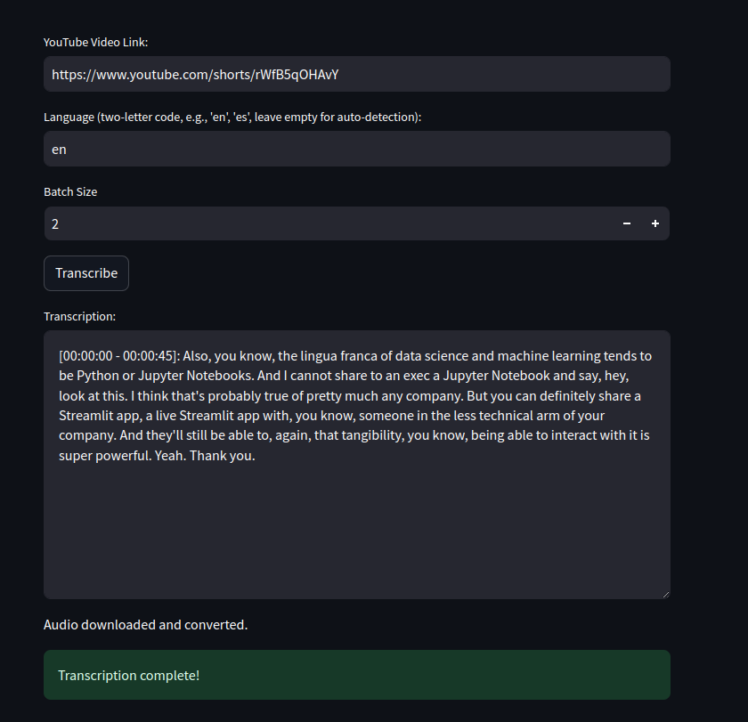

# YouTube Video Transcriber

A Streamlit app that transcribes YouTube videos using Whisper.

## How it works

- Downloads audio from YouTube videos.
- Splits audio into speech segments using Silero VAD.
- Transcribes segments in batches using OpenAI's Whisper model.
- Displays transcribed text with timestamps.

## Requirements

Listed in `requirements.txt`

## Usage

1. Install dependencies: `pip install -r requirements.txt`
2. Run the app: `streamlit run app.py`
3. Enter a YouTube video URL and optional language code.
4. Click "Transcribe".

## Screenshot

## License

MIT
